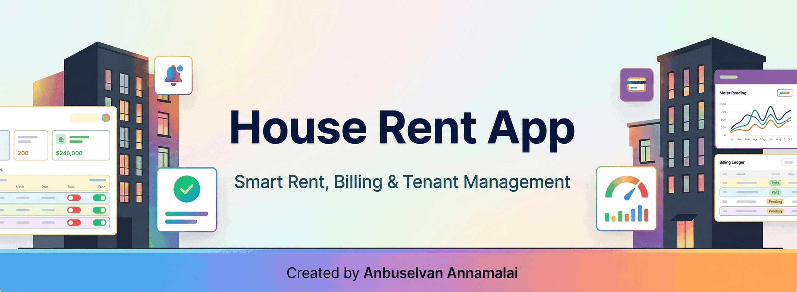

# House Rent App

House rent management app for tenant and owners. Runs on web, android, iOS, etc.

[](https://github.com/anburocky3/house-rent-app)
[](https://github.com/anburocky3/house-rent-app)
[](https://github.com/anburocky3/house-rent-app)

[](https://discord.gg/6ktMR65YMy)
[](https://www.youtube.com/c/cyberdudenetworks)



It supports admin and tenant workflows for:

- property management
- tenant management
- monthly billing and payment tracking
- complaints
- web push notifications

## Tech Stack

- Next.js (App Router)
- TypeScript
- Firebase (Firestore, Auth, FCM)
- Tailwind CSS
- Vercel (deployment and cron)

## Features

- Admin dashboard for properties, tenants, complaints, notifications, and settings
- Tenant dashboard for payment status, history, and account info
- Billing ledger tracking per property
- Meter-based unit consumption calculation
- Web push notifications (FCM)
- Month-end and month-start reminder automation using Vercel cron

## Project Structure

Key directories:

- `app/` - pages, API routes, UI components, and hooks
- `lib/` - reusable server/client utilities
- `scripts/` - migration and seed scripts
- `types/` - shared TypeScript types
- `public/` - static assets and service worker

## Prerequisites

- Node.js 20+ (or Bun)
- Firebase project (Firestore + FCM enabled)
- Service account credentials for server-side Firebase Admin actions

## Quick Start

1. Install dependencies:

```bash
npm install
```

2. Copy environment template and fill values:

```bash
cp .env.example .env.local
```

3. Start development server:

```bash
npm run dev
```

4. Open:

`http://localhost:3000`

## Environment Variables

Use `.env.example` as your source of truth. Important variables include:

- `NEXT_PUBLIC_FIREBASE_API_KEY`
- `NEXT_PUBLIC_FIREBASE_AUTH_DOMAIN`
- `NEXT_PUBLIC_FIREBASE_PROJECT_ID`
- `NEXT_PUBLIC_FIREBASE_STORAGE_BUCKET`
- `NEXT_PUBLIC_FIREBASE_MESSAGING_SENDER_ID`
- `NEXT_PUBLIC_FIREBASE_APP_ID`
- `NEXT_PUBLIC_FIREBASE_VAPID_KEY`
- `FIREBASE_SERVICE_ACCOUNT_JSON` or `FIREBASE_SERVICE_ACCOUNT_PATH`
- `ADMIN_API_SECRET`
- `NOTIFICATION_INTERNAL_API_KEY` (optional)
- `CRON_SECRET`
- `BLOB_READ_WRITE_TOKEN`

## Scripts

- `npm run dev` - Start local dev server
- `npm run build` - Create production build
- `npm run start` - Run production build locally
- `npm run lint` - Run ESLint
- `npm run migrate` - Migrate Firestore data
- `npm run migrate:fresh` - Fresh migration flow
- `npm run seed:firestore` - Seed Firestore with demo data

## Notifications Setup (FCM)

1. In Firebase Console, open Cloud Messaging.
2. Create a Web Push certificate and copy VAPID public key.
3. Set `NEXT_PUBLIC_FIREBASE_VAPID_KEY` in `.env.local`.
4. Sign in to the app and enable notifications from the UI.

Token sync writes `fcmToken` and device metadata to the user profile for easier device identification.

### Send a test notification

```bash
curl -X POST http://localhost:3000/api/notifications/send \
  -H "Content-Type: application/json" \
  -H "x-notification-key: YOUR_NOTIFICATION_INTERNAL_API_KEY" \
  -d '{
    "targetRole": "tenant",
    "title": "Meter reading reminder",
    "body": "Please check your updated electricity units.",
    "data": { "click_action": "/tenant" }
  }'
```

## Billing Notes

- Ledger entries are created when admin updates meter readings for a property.
- Current meter reading and previous reading are used to calculate consumed units and electricity totals.
- Payment status is tracked in `billing_ledger`.

## Cron Reminders (Vercel)

Configured in `vercel.json` for `/api/cron/monthly-reminders`:

- `30 4 1-3 * *` (first 3 days of month)
- `30 4 25-31 * *` (last week window, with in-route date checks)

The route sends:

- tenant reminders for pending rent
- admin reminders to enter meter readings where required

Set `CRON_SECRET` in Vercel and send it as Bearer token when invoking manually.

## Deployment

Recommended: Vercel.

1. Import repo in Vercel.
2. Add all required environment variables.
3. Deploy.
4. Verify cron jobs are active.

## Security Notes

- Never commit real service account JSON files.
- Use environment variables for secrets.
- Rotate `ADMIN_API_SECRET`, `NOTIFICATION_INTERNAL_API_KEY`, and `CRON_SECRET` regularly.

## Author

- Project Author: [Mr. Anbuselvan Annamalai](https://anbuselvan-annamalai.com)

## License: [MIT](./LICENSE)

## Contributing

1. Create a feature branch.
2. Make focused changes.
3. Run lint and local checks.
4. Open a pull request with clear description.

## Support

For setup and deployment issues, create an issue in this repository with:

- expected behavior
- actual behavior
- steps to reproduce
- environment details
